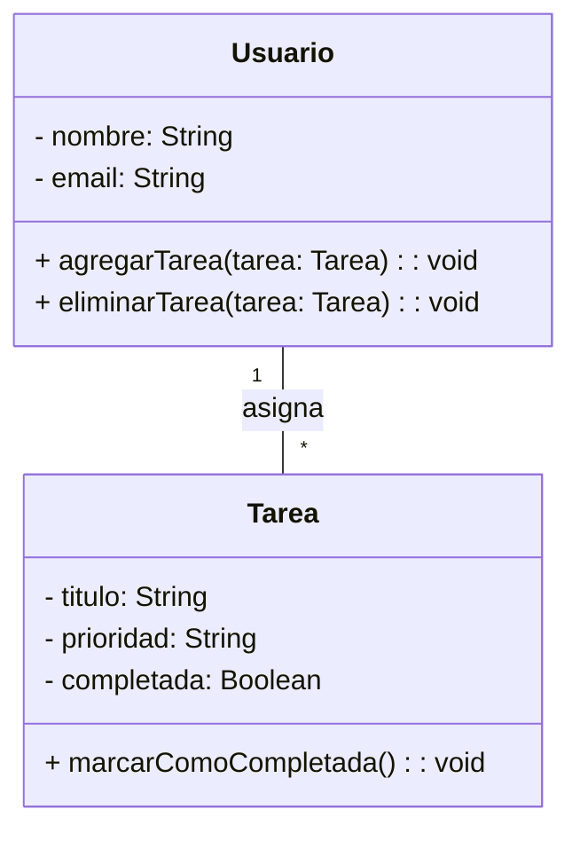

# TaskMaster - Aplicación de Gestión de Tareas

## Descripción

TaskMaster es una aplicación diseñada para mejorar la productividad, permitiendo gestionar tareas de manera eficiente. Con esta herramienta, los usuarios pueden organizar sus actividades diarias de manera sencilla y eficaz.

## Características

✔ Creación y edición de tareas.  
📅 Asignación de fechas límite y prioridades.  
- Prioridad baja, media y alta.  
- Fechas límite personalizadas con control de calendario.  
📂 Organización en categorías y etiquetas.  
✅ Marcar tareas como completadas.  
🔔 Notificaciones y recordatorios automáticos.  
📊 Visualización en lista y tablero Kanban.

## Instalación

Para instalar y ejecutar la aplicación, sigue los siguientes pasos:

```bash
# Clonar el repositorio
git clone https://github.com/danielmartinan/taskmaster.git
cd taskmaster

# Instalar dependencias
npm install

# Ejecutar la aplicación
npm start
```

## Uso de la API

TaskMaster proporciona una API REST para gestionar tareas. A continuación, un ejemplo de cómo crear una tarea usando JavaScript:

```javascript
fetch("https://api.taskmaster.com/tareas", {
  method: "POST",
  headers: { "Content-Type": "application/json" },
  body: JSON.stringify({
    titulo: "Nueva tarea",
    prioridad: "Alta"
  })
})
  .then(response => response.json())
  .then(data => console.log("Tarea creada:", data));
```

## Fórmula de Productividad

La eficiencia del usuario se calcula con la siguiente fórmula:

\[
E = \frac{\text{Tareas Completadas}}{\text{Tareas Totales}} \times 100
\]

Donde:
- **E** es la eficiencia en porcentaje.  
- **Tareas Completadas** es el número de tareas finalizadas por el usuario.  
- **Tareas Totales** es el número total de tareas asignadas.

## Diagrama de Clases

La siguiente representación en UML muestra la estructura del sistema:



## Capturas de Pantalla

A continuación, una vista previa de la interfaz de usuario:

*(Reemplaza estos ejemplos con capturas reales en `docs/`.)*

1. Haz clic en el botón **Nueva Tarea**.  
2. Completa el formulario con los datos de la tarea:  
   1. **Título**: Nombre de la tarea.  
   2. **Prioridad**: Nivel de importancia (baja, media, alta).  
   3. **Fecha Límite**: Día y hora de vencimiento.  
3. Haz clic en **Guardar** para crear la tarea.  
4. ¡Listo! La tarea se ha registrado correctamente.

> Para resaltar el título de la tarea en negrita, escribe el texto entre dobles asteriscos: `**Título de la Tarea**`.

## Historial de Versiones

| Versión | Fecha       | Descripción              |
|---------|-------------|--------------------------|
| 1.0.0   | 08/05/2025  | Lanzamiento inicial      |
|---------|-------------|--------------------------|
| 1.0.1   | 08/05/2025  | Arreglo url git          |

## Créditos

Desarrollado por [Cristian Rodríguez]
(https://github.com/Cris-2425/taskmaster_tarea_6.1).

## Licencia

Este proyecto está bajo la Licencia MIT.